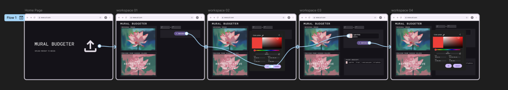
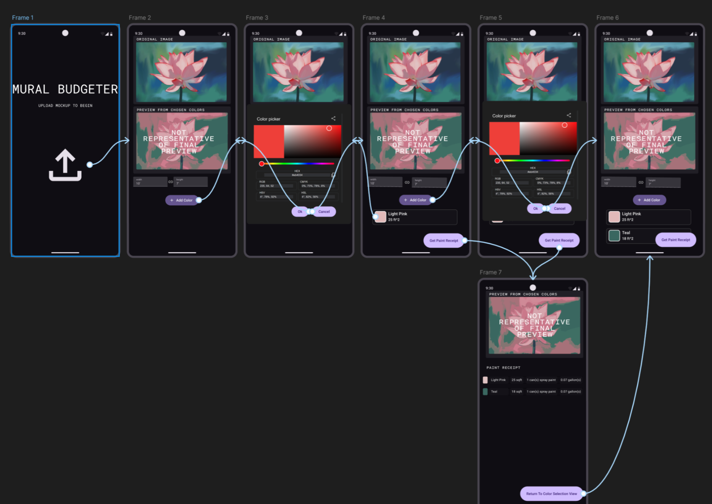
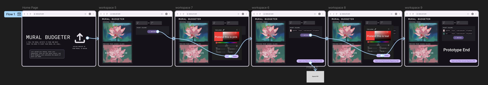
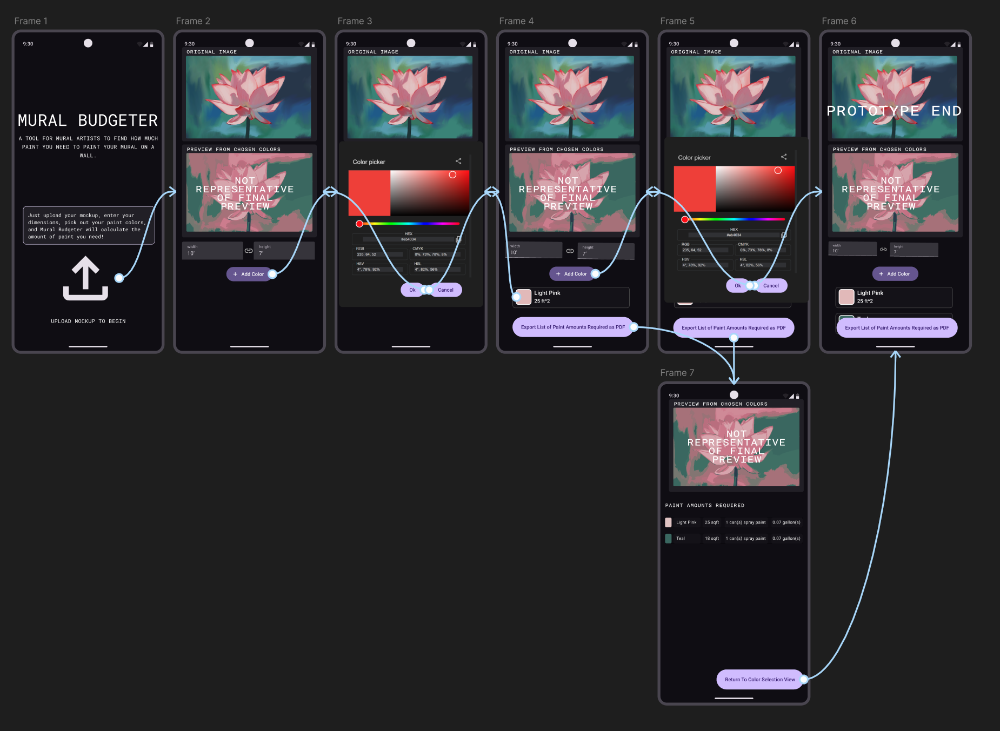
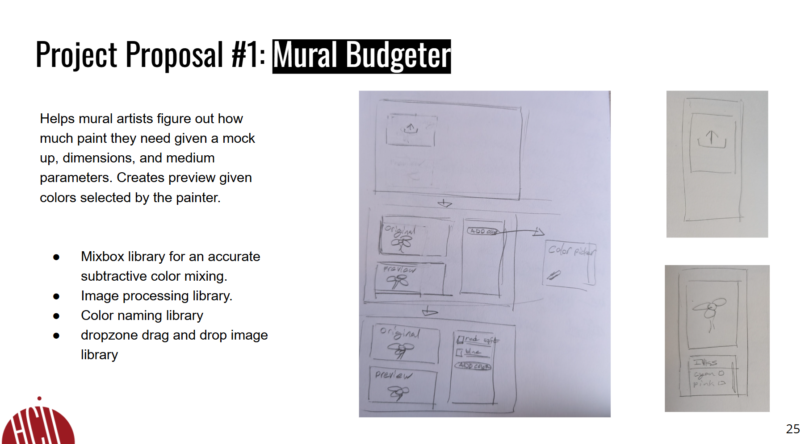
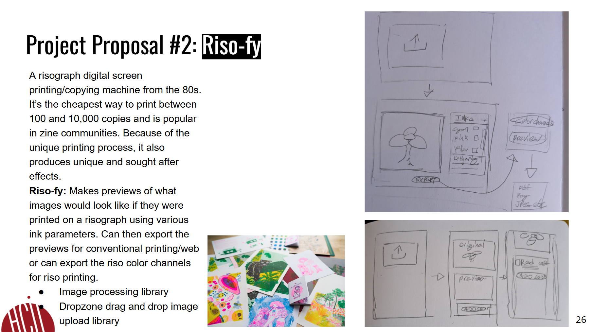
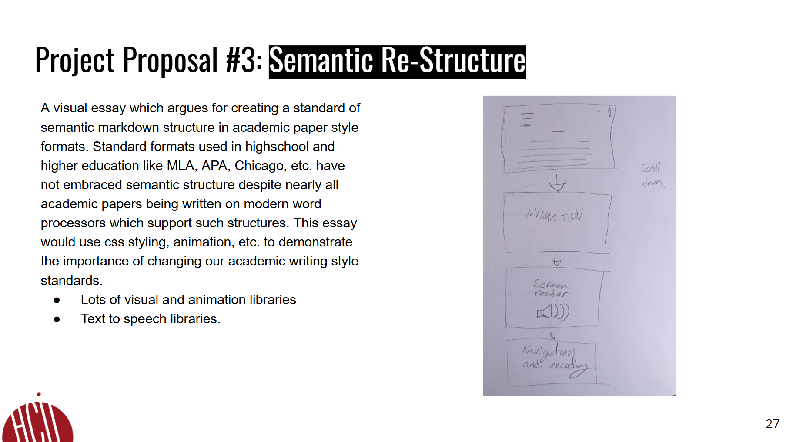

# **FP4 \- Final Project Writeup**

Feel free to refer to this [Markdown Cheat Sheet](https://www.markdownguide.org/cheat-sheet/) to make your writeup more organized, and you can preview your markdown file in VSCode [Markdown editing with Visual Studio Code](https://code.visualstudio.com/docs/languages/markdown#_markdown-preview). 

## Part 1: Website Description

Describe your website (300 words).

* What is the purpose of your website?   
* Who is the target audience?  
* What information do you convey with your website?   
* How is it interesting and engaging? 

## Part 2: User Interaction

How a user would interact with your website? For each step, briefly but clearly state the interaction type & how we should reproduce it.

1. Interaction type. Click on X on page Y / scroll on page X, etc.  
2. 

## Part 3: External Tool

Describe what important external tool you used (JavaScript library, Web API, animations, or other). Following the bulleted list format below, reply to each of the prompts.

1. Name of tool1  
   * Why did you choose to use it over other alternatives? (2 sentences max)  
   * How you used it? (2 sentences max)  
   * What does it add to your website? (2 sentences max)  
2. Name of tool2

## Part 4: Design Iteration

Describe how you iterated on your prototypes, if at all, including any changes you made to your original design while you were implementing your website and the rationale for the changes. (4-8 sentences max)

## Part 5: Implementation Challenge

What challenges did you experience in implementing your website? (2-4 sentences max)

## Part 6: Generative AI Use and Reflection

Describe how you used Generative AI tools to create this final project (fill in the following information, write \~500 words in total).

Document your use of all GenAI tools — ChatGPT, Copilot, Claude, Cursor, etc. using the template below. Add/Delete rows or bullet points if needed, and replace Tool1/Tool2 with the name of the tool.

### Usage Experiences by Project Aspects

Feel free to edit the column \_ (other?) or add more columns if there's any other aspect in your project you've used the GenAI tools for.

For the following aspects of your project, edit the corresponding table cell to answer:
- *Usage*: Whether you used / did not use this tool for the aspect. Enter [Yes/No]
- *Productivity*: Give a rating on whether this tool makes your productivity for X aspect [1-Much Reduced, 2-Reduced, 3-Slightly Reduced, 4-Not Reduced nor Improved, 5-Slightly Improved, 6-Improved, 7-Much Improved].

| Tool Name | Ratings | design | plan | write code | debug | \_ (other?) |
| :---- | :---- | :---- | :---- | :---- | :---- | :---- |
| Tool1 | Usage | Yes/No | Yes/No | Yes/No | Yes/No | Yes/No |
| Tool1 | Productivity | 1~7 | 1~7 | 1~7 | 1~7 | 1~7 |
| Tool2| Usage | Yes/No | Yes/No | Yes/No | Yes/No | Yes/No |
| Tool2 | Productivity | 1~7 | 1~7 | 1~7 | 1~7 | 1~7 |

### Usage Reflection

> Impact on your design and plan 
* It matched my expectations and plan in [FP2](#generative-ai-use-plan) in that … For example, 
  1. Tool1: 
  2. Tool2:
* It did not match my expectations and plan in [FP2](#generative-ai-use-plan) in that … For example, 
  1. Tool1: 
  2. Tool2:
* GenAI tool did/did not influence my final design and implementation plan because … For example, 
  1. Tool1: 
  2. Tool2:

> Use patterns
* I accepted the generations when …  For example, 
  1. Tool1: this tool once suggested … and I adjusted my design according to the suggestion because … 
  2. Tool2: 
* I critiqued/evaluated the generated suggestions by … For example, 
  1. Tool1: this tool once suggested … but I modified/rejected the suggestion because … 
  2. Tool2: 

> Pros and cons of using GenAI tools
* Pros
  1. Tool1: 
  2. Tool2:
* Cons
  1. Tool1: 
  2. Tool2:

### Usage Log

Document the usage logs (prompts and chat history links) for the GenAI tools you used. Some tools may not have an easy way to share usage logs, just try your best! Some instructions for different tools:

1. [ChatGPT](https://help.openai.com/en/articles/7925741-chatgpt-shared-links-faq) / [Gemini](https://support.google.com/gemini/answer/13743730?hl=en&co=GENIE.Platform%3DDesktop): share the anonymous link to all of your chat histories relevant to this project
2. [GitHub Copilot (VSCode)](https://code.visualstudio.com/docs/copilot/copilot-chat#:~:text=You%20can%20export%20all%20prompts%20and%20responses%20for%20a%20chat%20session%20in%20a%20JSON%20file%20with%20the%20Chat%3A%20Export%20Session...%20command%20(workbench.action.chat.export)%20in%20the%20Command%20Palette.): export chat histories relevant to this project.

---

# **FP3 \- Final Project Check-in**

Document the changes and progress of your project. How have you followed or changed your implementation & GenAI use plan and why? Remember to commit your code to save your progress.

## Implementation Plan Updates

- [ ] ...

## Generative AI Use Plan Updates

- [ ] ...

Remember to keep track of your prompts and usage for [FP4 writeup](#part-6-generative-ai-use-and-reflection).

---

# **FP2 \- Evaluation of the Final project**

## Project Description

Mural Budgeter: A tool for figuring out how much paint to buy when painting a mural.

## High-Fi Prototypes

### *Prototype 1*

Users upload a mockup image then input dimensions and add paint colors which are used
to calulate the amount of paint needed for that mural. 
Essentially users understood the tool after using it, however there were several points
of initial confusion for both mobile and desktop designs. These points could be fixed 
by changing some of the language and adding additional context clues where neccessary.

### *Prototype 2*

## Usability Test

The feedback can be synthesized into the following list:
- Receipt is a misleading name for the card containing the amount of paint needed.
- There should be a preview/info about what the app does on the home page.
- Add clipboard or file export for paint tally.
- Width/height is a bit too small small.
- The fonts are a little inconsistent.

The main problem I noticed from direct observation
was that the users didn't understand what the tool did until after going through everything.
Thus as I revised and continue to revise, I'm going to make sure to include as many context clues as I can
to make the affordances understandable.

All of the feedback was incredibly helpful as it highlighted the areas where the
design was confusing. Thus I did the following to impliment the feedback:

- Changed name of receipt.
- Added info about what the app does on the home page since the process was initially confusing.
- Added export for paint tally to create a sense of finality and remove the need to store files on the webpage.
- Increased size of width/height boxes for additional clarity.
- Homogenized fonts for more consistent design.

## Updated Designs

### *prototype 1 revised*

Revised prototypes from the above list. The overall structure is the same but additional context has been added and some of the language changed, as well as some visual tweaks.

### *prototype 2 revised*

## Feedback Summary

Overall there was some confusion about "get paint required" and the idea of a paint receipt.
While the language was less confusing than before, I might be able to add some additional context
clues to inprove the understandibily to the design. The different desktop and mobile views also confused
some because they thought I was making a mobile app. When presenting the mobile view in the future
I should describe it as the "mobile/vertical view of the website." One good idea that was called
to my attention was to add context popups that can help users make descisions. For example, 
yellow spray paint generally does not cover as well as other colors and that could be called to attention.
This idea of providing help and context info reactive to user input throughout the design will help users understand the
complexities of their task without being obtrusive or overwhelming.

## Milestones

Outline weekly milestones to plan your expected implementation progress until the end of the semester (\~300 words). 

### *Implementation Plan*

- [x] Week 9 Oct 28 \- Nov 1:
  - [X] FP1 due
  - [x] ...
  
- [x] Week 10 Nov 4 \- Nov 8:   
  - [x] FP2 due

- [ ] Week 11 Nov 11 \- Nov 15:  Finalize Design, import all libraries, get skeleton of site up.
- [ ] Week 12 Nov 18 \- Nov 22:  Get paint counting algorithm working.
- [ ] Week 13 Nov 25 \- Nov 29:  Get initial styling and formating done.

  - [ ] Thanksgiving  
- [ ] Week 14 Dec 2 \- Dec 6:  Finalize styling, fix any final bugs.
  - [ ] FP4 due 

### *Libraries and Other Components*

List the JS libraries and other components (if applicable) that you plan to use. 
* 
- Mixbox for subtractive color mixing.
- Dropzone for drag and drop.
- p5.js for image manipulation.

## Generative AI Use Plan

I do not plan on using generative AI for this project.

---

# **FP1 \- Proposal for Critique**

## Idea Sketches

### *Idea 1*

A tool for figuring out how much paint to buy when painting a mural. It is interactive because users will upload images and input dimensions and paint colors. To make the design accessible I will use a color naming library to help colorblind users make sure they're picking the colors they want.

### *Idea 2*

A tool which exports color channels from an image for risograph printing and creates a simulation of what the image would look like when printed on a risograph. This can be used both for those printing on risographs, or for those who do not access to them to mimic the effect. It is interactive because the user uploads images and selects parameters. To make the design accessible I will use a color naming library to help colorblind users make sure they're picking the colors they want.

### *Idea 3*

A visual essay which directly argues, as well as demonstates, the need for incorperating semantic structure into academic paper style formats. It will be interactive because as the user scrolls, the essay will transform. It will be accessible by being as well structured as it argues academic paper formats ought to be.

## Feedback Summary

The ideas were well received with emphasis on pursuing the mural budgeter idea and making it work for normal home improvement purposes as well. The method of inputing dimensions was discussed, with the idea that technologies like AR could be explored for this application. One of my group members is also a School of Art student and agreed that formatting for risograph is, as it stands, quite tedious. This feedback is helpful because it is direct from the target audience. One concern that was brought up for the project however is there might be significant difficulty in simulating the effect of the risograph, especially given the complexities of subtractive color mixing. Essentially I would be creating my own riso library and making an interactive UI for it. The essay idea did not get as much attention, however a callback to the WCAG guidelines for written text was helpful.

## Feedback Digestion

Even though the general consensus was towards the mural budgeter idea, I am still excited about the others. The risograph project poses the greatest engineering challenge, while the essay might be able to make the most impact. However since the risograph project would require me to create a library which calculates color transformations that would closest mimic a risograph, the engineering requirements of the project might take away too much of my focus from the design of the project. I was exicted by the discussion of using AR to enter dimensions for the mural budgeter, so I will explore some AR and computer vision libraries and judge their viability for this project. Using these libraries might allow greater functionality for home improvement purposes since measuring irregular walls can be difficult using just a tape measure.