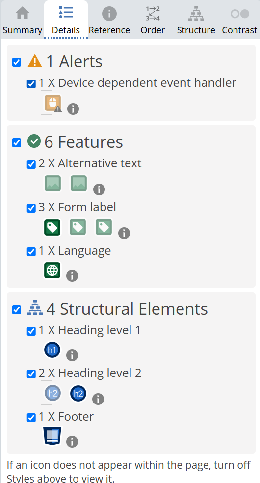

# **FP4 \- Final Project Writeup**

https://iwg-mk1.github.io/pui-hw-iwg/final-project/

## Part 1: Website Description

Describe your website (300 words).

Mural Budgeter is a tool for determining how much paint an artist needs to turn their mockup into a mural. The target audience is mural artists but after showing an earlier version of this project to School of Art professor Clayton Merrel (the one who made the floor in the Pittsburgh airport), he told me that its ability to calculate color weights could be useful for painters in general. The website conveys information about how to use it by calling out what the user needs to do with text or icons, then shows them the amount of paint they need for each color in square feet, standard sized cans of spray paint, and gallons of house paint. Having worked with several mural artists in the past and worked on several murals myself, I can say that spray paint and house paint are the industry standards. It is interesting and engaging because it updates the mural preview in real time and allows users to experiment with different color schemes.

## Part 2: User Interaction

How a user would interact with your website? For each step, briefly but clearly state the interaction type & how we should reproduce it.

1. Click on "choose file."
2. Select an image on your computer you want to turn into a mural.
3. Enter dimensions for your mural in the section "Add the dimensions of your surface."
4. Start adding colors to your palette by sampling colors from the original image by clicking on its pixels OR click the add color button.
5. Adjust your colors by clicking on the colored squares.
6. Remove Colors by clicking "remove color."
7. Keep playing around with these interactions until you're happy.

## Part 3: External Tool

### Screen Sizes:
This tool works best on desktop at both large (>540px width) and small (<540px width) sizes. It will also work on mobile phones although with less color sampling accuracy. I have not been able to test it on ipads.

Describe what important external tool you used (JavaScript library, Web API, animations, or other). Following the bulleted list format below, reply to each of the prompts.

1. Color Name API: https://github.com/meodai/color-name-api  
   * This API allowed me to choose between many different color name lists which was helpful in testing to find a list which had useful names. Many of these lists were made up of names like "Mountain Wind" which are not very useful. I needed names like "bluegrey" which immediately tells the user about what kind of color it is.
   * I fetched color names from the API which could describe the colors the user selected and displayed them with the color.
   * Color names help improve accessibility for colorblind users who might need additional context for their color selections. I've met many colorblind artists so this feature was important for me to add.
2. Material 3 Theme Builder: https://m3.material.io/blog/material-theme-builder
   * I wanted to use Material for this project but after two days of unsuccessful attempts to parse their surprisingly bad documentation and finding no peers who had gotten Material to work, I decided to instead just use their theme builder which gives me some of the quick adaptability features and provided a framework for me to use for color selection.
    * I used this tool to build my color theme for the site.
    * The website looks more coherent than it would if I was picking new colors every time I wanted to style an element. It will also make restyling easier in the future since I plan to continue developing this project.

## Part 4: Design Iteration

Describe how you iterated on your prototypes, if at all, including any changes you made to your original design while you were implementing your website and the rationale for the changes. (4-8 sentences max)

I iterated quite a bit from my prototypes. Mainly, I moved to a column display which helped keep the site consistent across a greater variety of screen sizes. I changed the drag and drop to a file input because it makes the design more efficient. Finally, I simplified the style for a cleaner interface.

## Part 5: Implementation Challenge

What challenges did you experience in implementing your website? (2-4 sentences max)

The biggest two challenges were performance and JavaScript async bugs. I was originally using p5.js for image manipulation but that was too slow, then I tried writing the image manipulation as a shader but that led to an incredible number of bugs which led me to realize that p5.js was not the right library for my purposes. I finally rewrote it without a library which greatly increased performance. Many of the random bugs I encountered were due to confusion on handling async behavior.

## Part 6: Generative AI Use and Reflection

I did not choose to use Generative AI for this project.

## Part 7: Appendix

---

# **FP3 \- Final Project Check-in**

Document the changes and progress of your project. How have you followed or changed your implementation & GenAI use plan and why? Remember to commit your code to save your progress.

## Implementation Plan Updates

- [ ] Got base functionality to work but its slow. Going to rewrite it as a shader. Still on track for comnpletion but with less time for styling.

## Generative AI Use Plan Updates

- [ ] ...

Remember to keep track of your prompts and usage for [FP4 writeup](#part-6-generative-ai-use-and-reflection).

---

# **FP2 \- Evaluation of the Final project**

## Project Description

Mural Budgeter: A tool for figuring out how much paint to buy when painting a mural.

## High-Fi Prototypes

### *Prototype 1*

Users upload a mockup image then input dimensions and add paint colors which are used
to calulate the amount of paint needed for that mural. 
Essentially users understood the tool after using it, however there were several points
of initial confusion for both mobile and desktop designs. These points could be fixed 
by changing some of the language and adding additional context clues where neccessary.

### *Prototype 2*

## Usability Test

The feedback can be synthesized into the following list:
- Receipt is a misleading name for the card containing the amount of paint needed.
- There should be a preview/info about what the app does on the home page.
- Add clipboard or file export for paint tally.
- Width/height is a bit too small small.
- The fonts are a little inconsistent.

The main problem I noticed from direct observation
was that the users didn't understand what the tool did until after going through everything.
Thus as I revised and continue to revise, I'm going to make sure to include as many context clues as I can
to make the affordances understandable.

All of the feedback was incredibly helpful as it highlighted the areas where the
design was confusing. Thus I did the following to impliment the feedback:

- Changed name of receipt.
- Added info about what the app does on the home page since the process was initially confusing.
- Added export for paint tally to create a sense of finality and remove the need to store files on the webpage.
- Increased size of width/height boxes for additional clarity.
- Homogenized fonts for more consistent design.

## Updated Designs

### *prototype 1 revised*

Revised prototypes from the above list. The overall structure is the same but additional context has been added and some of the language changed, as well as some visual tweaks.

### *prototype 2 revised*

## Feedback Summary

Overall there was some confusion about "get paint required" and the idea of a paint receipt.
While the language was less confusing than before, I might be able to add some additional context
clues to inprove the understandibily to the design. The different desktop and mobile views also confused
some because they thought I was making a mobile app. When presenting the mobile view in the future
I should describe it as the "mobile/vertical view of the website." One good idea that was called
to my attention was to add context popups that can help users make descisions. For example, 
yellow spray paint generally does not cover as well as other colors and that could be called to attention.
This idea of providing help and context info reactive to user input throughout the design will help users understand the
complexities of their task without being obtrusive or overwhelming.

## Milestones

Outline weekly milestones to plan your expected implementation progress until the end of the semester (\~300 words). 

### *Implementation Plan*

- [x] Week 9 Oct 28 \- Nov 1:
  - [X] FP1 due
  - [x] ...
  
- [x] Week 10 Nov 4 \- Nov 8:   
  - [x] FP2 due

- [x] Week 11 Nov 11 \- Nov 15:  Finalize Design, import all libraries, get skeleton of site up.
- [x] Week 12 Nov 18 \- Nov 22:  Get paint counting algorithm working.
- [x] Week 13 Nov 25 \- Nov 29:  Get initial styling and formating done.

  - [x] Thanksgiving  
- [ x Week 14 Dec 2 \- Dec 6:  Finalize styling, fix any final bugs.
  - [x] FP4 due 

### *Libraries and Other Components*

List the JS libraries and other components (if applicable) that you plan to use. 
* 
- Mixbox for subtractive color mixing.
- Dropzone for drag and drop.
- p5.js for image manipulation.

## Generative AI Use Plan

I do not plan on using generative AI for this project.

---

# **FP1 \- Proposal for Critique**

## Idea Sketches

### *Idea 1*

A tool for figuring out how much paint to buy when painting a mural. It is interactive because users will upload images and input dimensions and paint colors. To make the design accessible I will use a color naming library to help colorblind users make sure they're picking the colors they want.

### *Idea 2*

A tool which exports color channels from an image for risograph printing and creates a simulation of what the image would look like when printed on a risograph. This can be used both for those printing on risographs, or for those who do not access to them to mimic the effect. It is interactive because the user uploads images and selects parameters. To make the design accessible I will use a color naming library to help colorblind users make sure they're picking the colors they want.

### *Idea 3*

A visual essay which directly argues, as well as demonstates, the need for incorperating semantic structure into academic paper style formats. It will be interactive because as the user scrolls, the essay will transform. It will be accessible by being as well structured as it argues academic paper formats ought to be.

## Feedback Summary

The ideas were well received with emphasis on pursuing the mural budgeter idea and making it work for normal home improvement purposes as well. The method of inputing dimensions was discussed, with the idea that technologies like AR could be explored for this application. One of my group members is also a School of Art student and agreed that formatting for risograph is, as it stands, quite tedious. This feedback is helpful because it is direct from the target audience. One concern that was brought up for the project however is there might be significant difficulty in simulating the effect of the risograph, especially given the complexities of subtractive color mixing. Essentially I would be creating my own riso library and making an interactive UI for it. The essay idea did not get as much attention, however a callback to the WCAG guidelines for written text was helpful.

## Feedback Digestion

Even though the general consensus was towards the mural budgeter idea, I am still excited about the others. The risograph project poses the greatest engineering challenge, while the essay might be able to make the most impact. However since the risograph project would require me to create a library which calculates color transformations that would closest mimic a risograph, the engineering requirements of the project might take away too much of my focus from the design of the project. I was exicted by the discussion of using AR to enter dimensions for the mural budgeter, so I will explore some AR and computer vision libraries and judge their viability for this project. Using these libraries might allow greater functionality for home improvement purposes since measuring irregular walls can be difficult using just a tape measure.